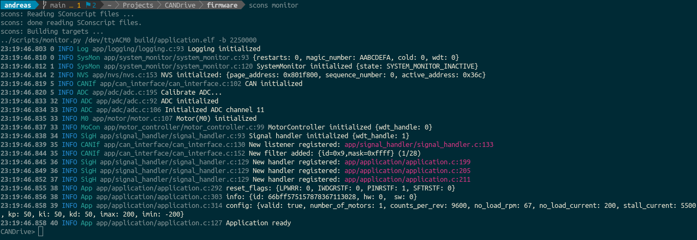

[](https://github.com/Andreasdahlberg/CANDrive/actions/workflows/github-actions.yml)
[](https://sonarcloud.io/dashboard?id=Andreasdahlberg_CANDrive)
[](https://sonarcloud.io/dashboard?id=Andreasdahlberg_CANDrive)

# CANDrive
CANDrive is a brushed DC Motor Controller controlled via a [CAN](https://en.wikipedia.org/wiki/CAN_bus) interface.

## Features

* Velocity control
* Torque control
* CAN interface
* Firmware updates over CAN
* Emergency stop
* 5 A output current
* 12-24 V supply voltage

## Getting started

### Getting the Source

This project is [hosted on GitHub](https://github.com/Andreasdahlberg/CANDrive). You can clone this project directly using this command:

```
git clone --recurse-submodules https://github.com/Andreasdahlberg/CANDrive.git
```

### Building

```
scons build-opencm
scons build
```

### Running Tests

Run all tests with valgrind:
```
scons test
```

Run a single test suite:
```
scons app/motor/test
```

Run a single unit test:
```
scons app/motor/test test_Motor_SetSpeed
```

### Tools

#### Monitor
The monitor tool is a serial terminal which parses serial output from the device and formats the
output to make it easier to read. It also incorporates a simple command line used for debug commands 
and device configuration. The debug commands are not intended for controlling the motors during normal 
operation since they bypass several of the safety features.

##### Features
* Host timestamps
* Color coded debug levels
* Translation from addresses to file and line
* Command line
* Filtering[Not implemented]



##### Usage
The monitor is started by typing *scons monitor*.
Serial port and baudrate can be configured [here](firmware/config.py) or on the command line, e.g.
*scons monitor SERIAL_PORT=/dev/ttyACM0 BAUD_RATE=921600*

The serial port used by the monitor is available at JP1 and is disabled by default. It can be 
enabled by moving jumper J1.

##### Available commands
###### rpm
rpm \[MOTOR_INDEX\] \[RPM\]

Ex.
```
CANDrive> rpm 0 50
```

###### current
current \[MOTOR_INDEX\] \[CURRENT\]

Ex.
```
CANDrive> current 1 1500
```

###### run
run \[MOTOR_INDEX\]

Ex.
```
CANDrive> run 0
```

###### coast
coast \[MOTOR_INDEX\]

Ex.
```
CANDrive> coast 0
```

###### brake
brake \[MOTOR_INDEX\]

Ex.
```
CANDrive> brake 0
```

###### reset
reset

Ex.
```
CANDrive> reset
```

###### level
level \[MODULE\] \[LEVEL\]

Ex.
```
CANDrive> level App 10
```

###### store
store \[PARAMETER\] \[VALUE\]

Ex.
```
CANDrive> store number_of_motors 1
```

## Hardware
[BOM](https://octopart.com/bom-tool/TDnAzRKf)
